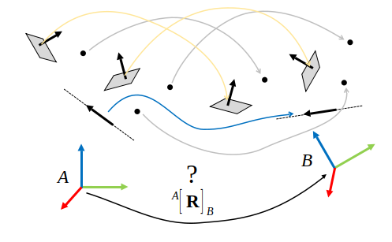

 

| Distro | Build dev | Build releases | Stable version |
| ---    | ---       | ---            | ---         |
| ROS 2 Humble (u22.04) |  |  |  |
| ROS 2 Iron (u22.04) |  |  |  |
| ROS 2 Rolling (u24.04) |  |  |  |

| Deprecated distros | Build releases | Stable version |
| ---                |  ---           | ---            |
| ROS 1 Noetic (u20.04) |  |  |

# `mp2p_icp`
C++ libraries for multi primitive-to-primitive (MP2P) ICP algorithms and flexible point cloud processing pipelines. `mp2p_icp` is used in the [mola_lidar_odometry](https://github.com/MOLAorg/mola_lidar_odometry) framework:

- [Main library documentation and C++ API](https://docs.mola-slam.org/mp2p_icp/)
- License: New BSD 3-Clause (Note that each module of [MOLA](https://github.com/MOLAorg/mola) has its own license)

## Introduction

The project provides these C++ libraries:
 * `mp2p_icp_map`: Provides the [`mp2p_icp::metric_map_t`](https://docs.mola-slam.org/latest/class_mp2p_icp_metric_map_t.html#doxid-classmp2p-icp-1-1metric-map-t) generic metric map container. Metric map files with extension `*.mm` are serializations of instances of this class.
 * `mp2p_icp`: With ICP algorithms. It depends on `mp2p_icp_map`.
 * `mp2p_icp_filters`: With point cloud filtering and manipulation algorithms. It depends on `mp2p_icp_map`.

And these applications:
 * [kitti2mm](apps/kitti2mm): Converts KITTI-like `.bin` files to `.mm` files.
 * [mm-filter](apps/mm-filter): CLI tool to apply a pipeline to an input metric map (`*.mm`), saving the result as another metric map file.
 * [mm-info](apps/mm-info): CLI tool to read a metric map (`*.mm`) and describe its contents.
 * [mm-viewer](apps/mm-viewer): GUI tool to visualize .mm (metric map) files.
 * [mm2txt](apps/mm2txt): CLI tool to export the layers of a metric map (`*.mm`) as CSV/TXT.
 * [mp2p-icp-log-viewer](apps/mp2p-icp-log-viewer): GUI to inspect results from ICP runs.
 * [mp2p-icp-run](apps/mp2p-icp-run): Standalone program to run ICP pipelines.
 * [sm2mm](apps/sm2mm): A CLI tool to convert a [simple map](https://docs.mrpt.org/reference/latest/class_mrpt_maps_CSimpleMap.html) `*.simplemap`
(from a SLAM mapping session) into a metric map (`*.mm`) via a configurable pipeline configuration file.
 * [sm-cli](apps/sm-cli): A CLI tool to inspect, visualize, or modify [simple maps](https://docs.mrpt.org/reference/latest/class_mrpt_maps_CSimpleMap.html) `*.simplemap` (from a SLAM mapping session).
 * [txt2mm](apps/txt2mm): CLI tool to convert pointclouds from CSV/TXT files to mp2p_icp mm.

Key C++ classes provided by this project (see [full docs](https://docs.mola-slam.org/mp2p_icp/)):
 * [`mp2p_icp::metric_map_t`](https://docs.mola-slam.org/latest/class_mp2p_icp_metric_map_t.html#doxid-classmp2p-icp-1-1metric-map-t): A generic
   data type to store raw or processed point clouds, e.g. segmented, discrete
   extracted features. Note that filtering point clouds is intentionally left
   outside of the scope of this library.
   See [MOLA](https://github.com/MOLAorg/mola) for possible implementations.
 * [`mp2p_icp::ICP_Base`](https://docs.mola-slam.org/latest/): A uniform API
   for matching those generic point clouds.
 * Implementations/wrappers of different ICP algorithms under such uniform API.
 * The library exposes both, complete iterative ICP algorithms, and the
 underlying optimal transformation estimators which are run at each ICP iteration.

