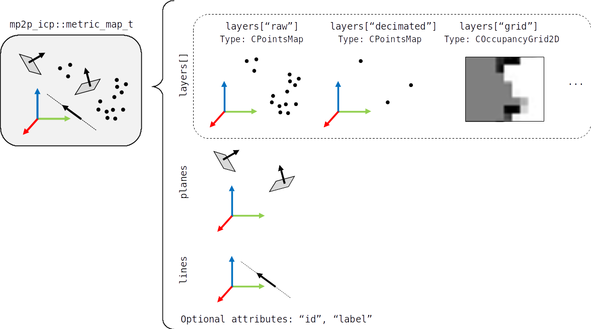

.. _mp2p_icp_basics:

=================
Basics
=================

1. Data structures
####################

Metric maps: point clouds, and more
---------------------------------------

The basic data class is ``metric_map_t``. It comprises:

  - A set of **map layers**, each one an instance of a generic `mrpt::maps::CMetricMap <https://docs.mrpt.org/reference/latest/class_mrpt_maps_CMetricMap.html>`_, typically point clouds (`mrpt::maps::CSimplePointsMap <https://docs.mrpt.org/reference/latest/class_mrpt_maps_CSimplePointsMap.html>`_) but may hold also 2D grid maps (`mrpt::maps::COccupancyGridMap2D <https://docs.mrpt.org/reference/latest/class_mrpt_maps_COccupancyGridMap2D.html>`_) or 3D octomaps (`mrpt::maps::COctoMap <https://docs.mrpt.org/reference/latest/class_mrpt_maps_COctoMap.html>`_). Layers are indexed by a **name** (``std::string``).

  - Other geometric entities: lines, planes.

Pairings
-------------

.. image:: imgs/Pairings.png
  :width: 400

2. Algorithms
##################

Write me!

3. YAML pipeline definition files
###################################

Write me!

